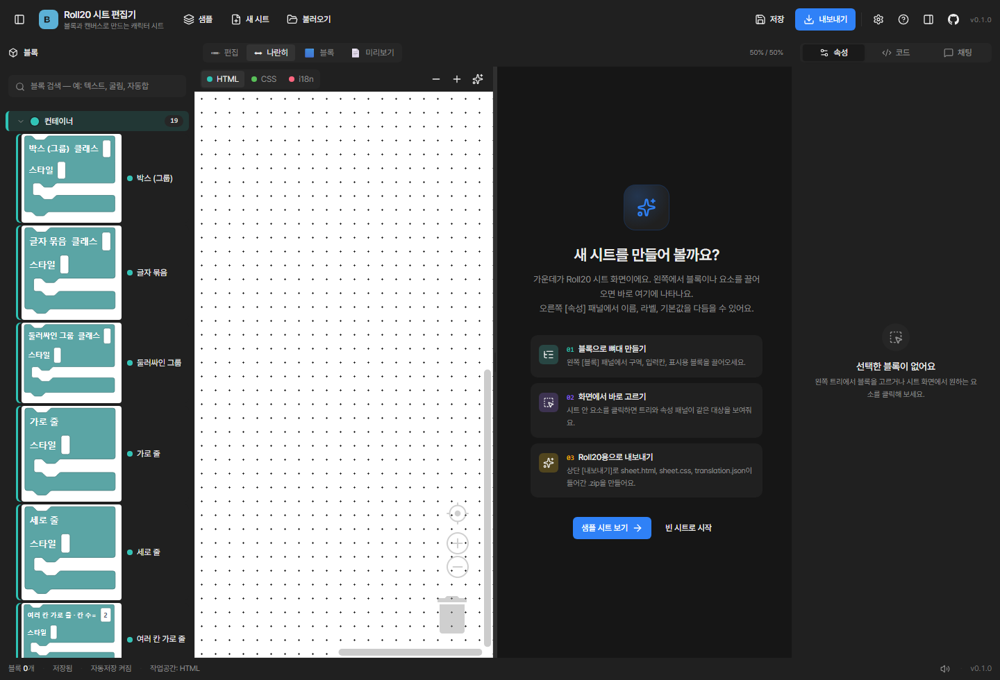
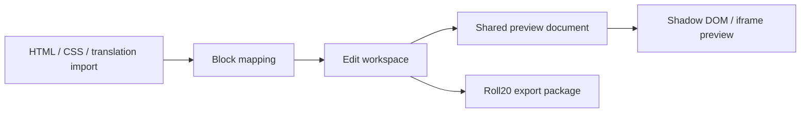

# Roll20 Block Editor

> Roll20 커스텀 캐릭터 시트를 블록과 시각 편집으로 만드는 웹 에디터

<p>
  
  
  
  
  
</p>



## 한눈에 보기

| 문제 | 해결 방향 |
| --- | --- |
| Roll20 시트 제작은 HTML, CSS, 번역, rolltemplate, Sheet Worker를 함께 알아야 합니다. | 시트 구조를 블록으로 쪼개고, 실제 화면 위에서 Figma처럼 조작할 수 있는 편집 경험을 만듭니다. |
| 원본 시트는 Roll20 환경에서만 제대로 보이는 경우가 많습니다. | Roll20 wrapper, base CSS, Shadow DOM 격리, preview/edit 공통 렌더 경로를 맞춰 갑니다. |
| 비개발자는 코드를 직접 고치기 어렵고, 개발자는 fidelity 손실을 확인하기 어렵습니다. | 사용자 친화적 편집 UI와 자동 검증 파이프라인을 함께 설계합니다. |

## 핵심 경험

|  | 기능 | 설명 |
| --- | --- | --- |
| 01 | 블록 기반 구조 편집 | HTML/CSS/translation을 Blockly 작업공간으로 분리해 시트 구조를 시각적으로 다룹니다. |
| 02 | 실제 렌더 위 시각 편집 | 편집 화면을 별도로 그리지 않고 실제 시트 렌더 결과 위에 overlay를 얹는 방향으로 설계합니다. |
| 03 | Roll20 스타일 미리보기 | Roll20 dialog context, base CSS, 사용자 CSS 순서를 재현해 사이트 CSS 침범을 막습니다. |
| 04 | 내보내기 기반 워크플로우 | Roll20 sandbox에 올릴 수 있는 HTML/CSS/translation/export 흐름을 목표로 합니다. |

## 기술 카드

| Frontend | Editor | State & Data | Verification |
| --- | --- | --- | --- |
| Next.js 16 | Blockly 12 | Zustand | Playwright smoke |
| React 19 | Shadow DOM preview | IndexedDB autosave | Roundtrip scripts |
| TypeScript | Roll20 CSS baseline | JSZip export | Visual/cascade diagnostics |
| Tailwind CSS v4 | Layer role model | Static export | GitHub Actions |

## 구현 포인트



- **CSS 격리**: 앱 UI 스타일이 시트 미리보기로 새지 않도록 Shadow DOM과 source-order 진단을 사용합니다.
- **원본 보존**: 사용자 시트 원본을 임의로 정리하지 않고, 의미 있는 Roll20 속성을 잃지 않는 방향으로 import/export를 개선합니다.
- **편집 UX**: 모든 요소를 단순 absolute 배치로 고정하지 않고, frame/flow/table 컨테이너에 들어갈 때의 동작을 분리합니다.
- **검증 우선**: "된다"가 아니라 어떤 범위에서 확인됐는지를 내부 리포트와 TODO로 분리해 관리합니다.

## 실행

```bash
corepack pnpm install
corepack pnpm run dev
corepack pnpm run lint
corepack pnpm run build
```

개발 서버:

```text
http://localhost:3000
```

배포:

```text
https://song991123.github.io/roll20-block-editor/
```

## 더 자세히

| 문서 | 내용 |
| --- | --- |
| [docs/spec](docs/spec) | Roll20 출력, WYSIWYG, mapping contract 등 기술 명세 |
| [docs/ux](docs/ux) | DOM/layer 기반 편집 모델과 상호작용 설계 |
| [docs/qa/31_active_todo.md](docs/qa/31_active_todo.md) | 현재 작업 TODO와 검증 상태 |
| [docs/operations](docs/operations) | 에이전트 작업 규칙, 브랜치, 검증 운영 방식 |

## 공개 저장소 주의

실제 Roll20 공식/커뮤니티/사용자 시트 파일과 그 파생 fixture/report는 저작권과 배포 범위 문제 때문에 공개 저장소에 포함하지 않습니다. 개발 검증용 자료는 로컬 ignored 경로에서만 사용하고, 공개 README에는 저작권 안전한 앱 화면 캡처만 사용합니다.
